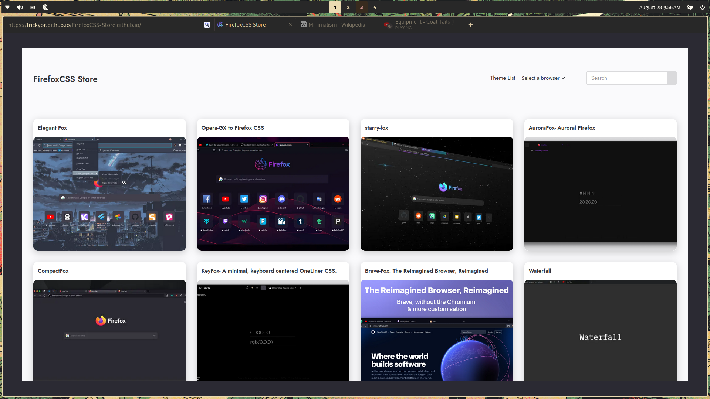

# minimalistest-oneliner-librewolf-
a super minimalist oneliner userchrome for firefox



# notes
## navigation
I use the vimium plugin for navigation, so refresh, back, etc are hidden. this can be changed by commenting:
```
line 27-31 (back/forwards buttons)
line 34-38 (extensions button)
```

## credits
this theme is a modified version of (Jaront Maciej's essence theme)[https://github.com/JarnotMaciej/Essence].
